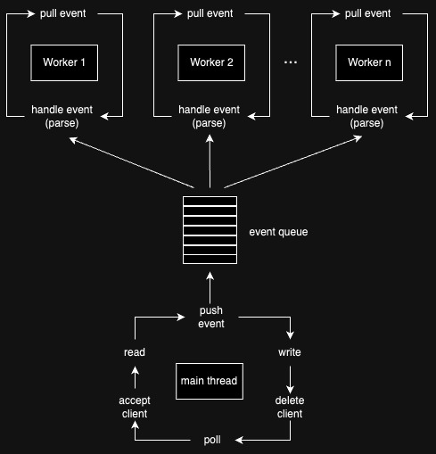

# postgres-proxy

This project is a simple proxy server that allows to log all sql requests sending through it.

## Compilation
```bash
# Compiles server
make

# Re-compiles server and cleanes logs directory
make re
```

## Run

### Flags

| Short flag | Long flag | Description | Default value | 
| ------------- | ------------- | ------------- | ------------- |
| -th | --target-host  | Target host (IPv4 addr) | 127.0.0.1 |
| -tp | --target-port  | Target port (IPv4 addr) | 5432 |
| -h | --host  | Proxy host (current machine) | 127.0.0.1 |
| -p | --port  | Proxy port (current machine) | 8080 |
| -w | --workers  | Workers(threads) count | 3 |
| -d | --log-dir  | Logs directory | logs |
| -l | --log-lvl  | Logs level | 2,  INFO |
| -a | --log-all-msg | Log all messages | false |

### Log levels
| Level | Prefix | Description | 
| ------------- | ------------- | ------------- |
| 0 |  CRIT | Critical errors logs only (system functions failure) |
| 1 |  ERROR | All error logs |
| 2 |  INFO | Errors and information logs |
| 3 |  DEBUG | Errors, info and debug logs |


### Examples:

```bash
# Use default
./pg_proxy 

# Tries to connect to db on 10.11.12.13:6789
pg_proxy -th "10.11.12.13" -tp 6789

# Launches proxy server on 4444 port
pg_proxy --port 4444

# Log level set to DEBUG level
pg_proxy -l 3 

# Directory with logs
pg_proxy -d <logdir>

# Worker threads count set to 4
./pg_proxy -w 4
```

## Description

This server uses two [Logger](./include/Log.hpp) class loggers:
- The first one (Log) used to output server's log messages.
- The second (queryLog) used to output parsed query messages.

Loggers set up separately. </br>
By default the first outputs to stdout and to file,
and the second outputs only to the file by default (prefixed with <b>"query-"</b>).

### Server diagram:



### Logs examples


Query logs only example (default):
```log
2024-02-26 21:46:04  INFO Logging into logs/query-26-02-2024_21-46-04.log
2024-02-26 21:46:14 SHOW config_file;
2024-02-26 21:46:38 select * from information_schema.tables limit 10;
2024-02-26 22:25:43 select * from information_schema.tables limit 50;
2024-02-26 22:25:55 select * from information_schema.tables limit 60;
2024-02-26 22:26:00 select * from information_schema.tables limit 70;
2024-02-26 22:26:04 select * from information_schema.tables limit 80;
2024-02-26 22:26:06 select * from information_schema.tables limit 90;
2024-02-26 22:26:10 select * from information_schema.tables limit 95;
2024-02-26 22:26:12 select * from information_schema.tables limit 99;
...
```

Full messages logs example (`-a` flag):
```log
2024-02-27 20:00:00  INFO Logging into logs/query-27-02-2024_20-00-00.log
2024-02-27 20:00:03     8 [4][210][22]/
2024-02-27 20:00:03 N  
2024-02-27 20:00:03    84 [0][3][0][0]user[0]mhufflep[0]database[0]postgres[0]application_name[0]psql[0]client_encoding[0]UTF8[0][0]
2024-02-27 20:00:03 R   8 [0][0][0][0]
2024-02-27 20:00:03 S  26 application_name[0]psql[0]
2024-02-27 20:00:03 S  25 client_encoding[0]UTF8[0]
2024-02-27 20:00:03 S  23 DateStyle[0]ISO, MDY[0]
2024-02-27 20:00:03 S  38 default_transaction_read_only[0]off[0]
2024-02-27 20:00:03 S  23 in_hot_standby[0]off[0]
2024-02-27 20:00:03 S  25 integer_datetimes[0]on[0]
2024-02-27 20:00:03 S  27 IntervalStyle[0]postgres[0]
2024-02-27 20:00:03 S  20 is_superuser[0]on[0]
2024-02-27 20:00:03 S  25 server_encoding[0]UTF8[0]
2024-02-27 20:00:03 S  36 server_version[0]14.11 (Homebrew)[0]
2024-02-27 20:00:03 S  35 session_authorization[0]mhufflep[0]
2024-02-27 20:00:03 S  35 standard_conforming_strings[0]on[0]
2024-02-27 20:00:03 S  32 TimeZone[0]Asia/Yekaterinburg[0]
2024-02-27 20:00:03 K  12 [0][0]x[132][157]]*[154]
2024-02-27 20:00:03 Z   5 I
2024-02-27 20:00:05 Q  45 select * from information_schema.tables;[0]
...
```

Server logs example:
```log
2024-02-27 20:00:00  INFO Logging into logs/27-02-2024_20-00-00.log
2024-02-27 20:00:00  INFO Listening on 127.0.0.1:8080
2024-02-27 20:00:00  INFO Server is starting on 127.0.0.1:8080
2024-02-27 20:00:00  INFO Proxying to 127.0.0.1:5432
2024-02-27 20:00:00  INFO Log level: 3
2024-02-27 20:00:00  INFO Log directory: logs
2024-02-27 20:00:00 DEBUG Worker 0x16f05b000 started
2024-02-27 20:00:00 DEBUG Worker 0x16f0e7000 started
2024-02-27 20:00:00 DEBUG Worker 0x16f173000 started
2024-02-27 20:00:03 DEBUG Server::connect [6] -> [7]
2024-02-27 20:00:03 DEBUG Client:: [6]: READ_REQUEST event added
2024-02-27 20:00:03 DEBUG Socket::read [6]: 8 bytes
2024-02-27 20:00:03 DEBUG Client::parse [6]: 8 bytes
2024-02-27 20:00:03 DEBUG Client:: [7]: PASS_REQUEST event added
2024-02-27 20:00:03 DEBUG Socket::write [7]: 8/8 bytes
2024-02-27 20:00:03 DEBUG Client:: [7]: READ_RESPONSE event added
2024-02-27 20:00:03 DEBUG Client:: [7]: READ_RESPONSE event added
2024-02-27 20:00:03 DEBUG Socket::read [7]: 1 bytes
2024-02-27 20:00:03 DEBUG SSL response
2024-02-27 20:00:03 DEBUG Client::parse [7]: 1 bytes
...
```


